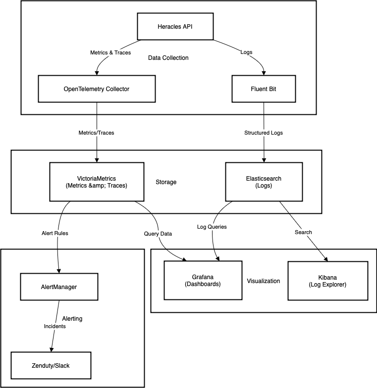

# Atlan Observability Intern Challenge 2025



A solution to improve debugging efficiency for Atlan engineers by enhancing observability for the Heracles API. Built with VictoriaMetrics, OpenTelemetry, Grafana, and Elasticsearch.

## Prerequisites

- Docker & Docker Compose
- `curl` (for testing)
- Basic terminal/CLI knowledge

## Setup

1. **Clone the repository**:
   ```bash
   git clone https://github.com/Tr0nML/atlan-soln.git
   cd atlan-soln
   ```

2. **Run services with Docker Compose**:
   ```bash
   docker-compose up -d
   ```
   This starts:
   - VictoriaMetrics (metrics storage)
   - Elasticsearch + Kibana (logs)
   - OpenTelemetry Collector
   - Fluent Bit (log forwarder)
   - Grafana (dashboards)
   - Mock Heracles API (test service)

3. **Configure Grafana**:
   - Open Grafana at `http://localhost:3000` (login: `admin/admin`).
   - Add data sources:
     - **VictoriaMetrics**: URL `http://victoriametrics:8428`
     - **Elasticsearch**: URL `http://elasticsearch:9200`, Index `heracles-*`

4. **Import the dashboard**:
   - Navigate to **Create → Import** and paste the [Grafana Dashboard JSON](./grafana-dashboard.json).

## Configuration Files

### 1. OpenTelemetry Collector (`otel-collector-config.yaml`)
Collects metrics/traces from Heracles and exports to VictoriaMetrics:
```yaml
# See otel-collector-config.yaml in repo
```

### 2. Fluent Bit (`fluent-bit.conf`)
Forwards structured logs to Elasticsearch:
```ini
# See fluent-bit.conf in repo
```

### 3. Heracles API Logging
A sample Flask app with structured logging:
```python
# app.py
from flask import Flask
import logging
import json_log_formatter

app = Flask(__name__)

formatter = json_log_formatter.JSONFormatter()
handler = logging.StreamHandler()
handler.setFormatter(formatter)
app.logger.addHandler(handler)

@app.route('/api/v1/assets')
def get_assets():
    app.logger.info("Fetching assets", extra={'trace_id': 'abc123'})
    return "OK"

if __name__ == '__main__':
    app.run(host='0.0.0.0', port=5000)
```

## Usage

### Generate Load
Send requests to the mock API to populate metrics/logs:
```bash
curl http://localhost:5000/api/v1/assets
```

### View Dashboards
1. Open Grafana at `http://localhost:3000`.
2. Navigate to the **Atlan Heracles API Observability** dashboard.
3. Filter by `environment` or `endpoint`.

### Check Logs in Kibana
1. Open Kibana at `http://localhost:5601`.
2. Create an index pattern for `heracles-*`.
3. Search logs with `trace_id:"abc123"`.

## Troubleshooting

| Issue                      | Solution                          |
|----------------------------|-----------------------------------|
| No metrics in Grafana      | Check if Heracles API is running  |
| Logs missing in Kibana     | Verify Fluent Bit container logs  |
| Dashboard panels empty     | Confirm VictoriaMetrics data source in Grafana |

---

**License**: MIT  
**Maintainer**: Aryan Garg


